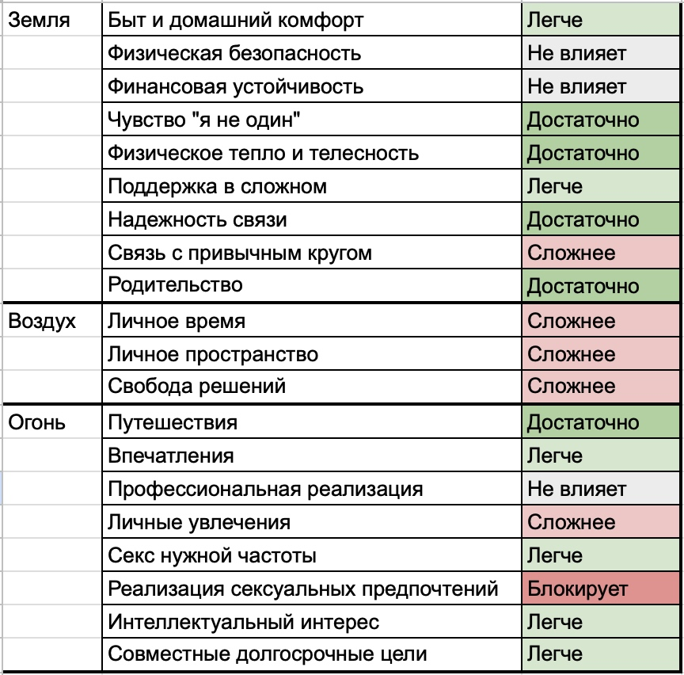

# Экономика выбора

Как выбрать, когда одновременно хватает и плюсов, и минусов? Работа может давать интересные задачи, деньги и влияние — и одновременно отнимать слишком много времени и сил. В отношениях мне может быть хорошо за счет тепла, надежности и чувства "я не один", и плохо из-за ограничений автономии или неудовлетворенности в сексе.

Разные стороны одной жизненной сферы вполне могут создавать ощущение "мне одновременно и хорошо, и плохо", и это совсем не значит, что со мной что-то не так.

## Потребность как единица анализа

На примере отношений видно, почему привычные критерии их оценки могут оказаться слишком абстрактными или недостаточными: забота, доверие, уважение, сексуальное влечение.

Возьмем заботу. За этим словом могут стоять помощь в бытовых вопросах, эмоциональная поддержка или постоянная готовность помочь. При этом участие в моей жизни способно как облегчать жизнь, так и ограничивать мою автономию, если это делается без запроса.

С сексуальным влечением похожая история. Оно может быть высоким и взаимным, а сексуальная жизнь — неудовлетворительной из-за частоты секса, отсутствия инициативы или несовпадения предпочтений.

Поэтому вместо абстрактных критериев лучше использовать язык **потребностей**: "что мне надо", "чего я хочу".

До какой степени имеет смысл декомпозировать свои ощущения? Принцип простой: если один пункт хочется одновременно записать и в плюсы и в минусы, скорее всего, внутри еще склеены разные потребности. Например, "высокая ответственность" на работе может одновременно означать большой удельный вес в команде и высокую нагрузку.

Конкретный вариант декомпозиции я уже разбирал на примере работы: ["Критерии удовлетворенности работой: от выбора вакансии до регулярной диагностики"](../job-satisfaction/2026-09-25%20Job%20satisfaction.md).

## Земля, воздух, огонь

Для себя я выделяю три группы потребностей.

- **Земля** — опора: здоровье, деньги, жилье, семья, надежные связи, быт, место в среде.

- **Воздух** — свобода: автономия, время, пространство, возможность выбирать.

- **Огонь** — живость: интерес, страсть, новизна, амбиции, ощущение движения.

Интересно, что эти группы связаны. Больше Земли обычно означает больше связей и обязательств, а значит, меньше Воздуха. Больше Воздуха дает свободу маневра, за что приходится платить частью устойчивости.

Метафору можно продолжить. Огню нужны как горючее, так и окислитель. Похожим образом интерес и страсть легче возникают там, где одновременно хватает и опоры, и свободы. Слишком жесткая конструкция лишает Огонь окислителя, а одна свобода без достаточной опоры создает дефицит горючего.

На примере работы группировка может выглядеть так.
**Земля** — доход, стабильность, команда.
**Воздух** — полномочия, график, удаленка, удельный вес в команде.
**Огонь** — интересность задач, масштаб ответственности, развитие.

На примере отношений — так.
**Земля** — надежность связи, общий быт, поддержка, тепло, чувство "я не один".
**Воздух** — автономия, личное время и пространство, свобода решений.
**Огонь** — секс, влечение, совместные впечатления, новизна, общие цели и интересы.

Границы между группами зависят от смысла конкретной потребности для конкретного человека. "Родительство" для одного может быть в большей степени Землей — семьей, принадлежностью, устойчивым "мы". Для другого — Огнем, главным жизненным проектом и источником смысла. Спорт может быть Воздухом, если это больше про собственное время и свободу распоряжаться собой, или Огнем, если главное в нем — азарт и драйв.

## Экономика варианта

Я удовлетворяю свои потребности из разных источников. Поддержку могу получать от партнера, друзей или родственников. Интерес — от работы, собственных проектов и увлечений. Общение, признание, безопасность, секс тоже не обязаны принадлежать какой-то одной сфере жизни.

Все эти источники образуют **экосистему** удовлетворения потребностей. Новый вариант, встраиваясь, изменяет ее: может дать новый источник, ничего не изменить или, наоборот, затруднить то, что раньше было доступно.

Плюс — получать нужное становится проще или потребность удовлетворяется в достаточной степени.
Ноль — возможность остается примерно той же.
Минус — получать нужное становится сложнее или невозможно.

Например, появился человек, с которым есть регулярная телесная близость — плюс. Партнер не разделяет мое хобби, но у меня осталось сообщество и партнер никак не препятствует — ноль. Ревность партнера ограничила общение с друзьями — минус.

В экономическом смысле минусы и есть издержки варианта — то, чем приходится платить за его плюсы.

Шкала показывает знак влияния. О значимости она ничего не говорит: один минус может почти не беспокоить, другой — затмевать все остальные.

## Пример декомпозиции

Возьмем условного женатого молодого человека. Он любит сидеть дома, у него есть хобби, ценит автономию, при этом хочет надежных отношений, телесной близости и семьи, но часть его сексуальных предпочтений реализовать не получается.

Его таблица может выглядеть примерно так:

Теперь понятно, как ему может быть одновременно хорошо и плохо. Отношения дают много Земли, заметно ограничивают Воздух и неоднозначно влияют на Огонь.

Таблица делает экономику варианта **видимой**.

## Изменить вариант

Первое следствие формализации своих ощущений — мы получаем возможность для целенаправленных действий: поддерживать ставшие привычными плюсы и попробовать уменьшить или убрать конкретные минусы.

В отношениях можно договориться о распределении быта, вернуть себе время на собственные занятия или попробовать изменить сексуальную жизнь. В случае с работой — обсудить зарплату, график, зону ответственности или формат присутствия в офисе.

Часть потребностей можно вообще закрыть из других источников: вернуть хобби, друзей, собственные проекты. Тогда конкретный минус может стать менее значимым.

## Ожидание и реальность

Все варианты, которых у меня сейчас нет, существуют для меня только как прогноз. Выбирая между двумя оферами, я в обоих случаях представляю, как мне там будет. То же самое с переездом, новым проектом или началом отношений.

Другой случай, когда один из вариантов уже является моей жизнью. Тогда сравнение оказывается асимметричным: **один вариант я знаю из опыта, остальные приходится моделировать**.

Вернемся к отношениям. Наш условный молодой человек знает, за счет чего ему в них хорошо и за счет чего плохо. А жизнь после расставания он может только прогнозировать. Возможно, у него станет больше автономии. Но какой будет сексуальная жизнь, что будет с чувством одиночества и устройством быта — пока неизвестно.

Из-за этого сравнение получается нечестным. Можно поставить рядом реальные недостатки нынешней жизни и идеализированную альтернативу, в которой новые возможности уже появились, а новые проблемы еще нет. Можно сделать обратное: считать плюсы текущей жизни надежными, а альтернативу описывать в основном через риски.

Неопределенность будущих вариантов убрать нельзя. Но можно хотя бы понимать, где реальный опыт, а где фантазии.

## Цена перехода

Когда базовым вариантом является нынешняя жизнь, переход к альтернативе сам становится частью ее цены. В расчет "уйти" попадают не только будущие плюсы и минусы, но и перестройка жизни.

У смены работы это может быть переезд или несколько месяцев переобучения. У эмиграции — деньги, документы, другой язык и новая повседневность. У выхода из длительных отношений — раздел имущества, изменение формата родительства и круга общения.

Поэтому два человека с очень похожей таблицей отношений могут принимать разные решения, если у одного переход в другую жизнь — чемодан и новый Tinder, а у другого — дети, общая ипотека и двадцать лет совместной жизни.

Потраченные годы, деньги и силы уже невозвратны ("sunk cost"). Для выбора имеет значение то, во что они успели превратиться: дети, общий дом, привычный быт, репутация, экспертиза, социальные связи. Все это уже встроено в нынешнюю жизнь, и при переходе часть придется потерять или перестроить. В *Investment Model of Commitment* (Rusbult, 1980) именно такие вложения рассматриваются как один из факторов, удерживающих человека в отношениях.

В итоге человек может оставаться в текущем варианте потому, что такая экономика его устраивает. А может — потому что привлекательность альтернативы пока не покрывает цену перехода. Снаружи выглядит одинаково: **отношения устойчивы, но мотивы разные**.

## Где же выбор?

Большинство решений не требует сознательной декомпозиции. Более того, решение "я хочу" или "я не хочу" возникает еще до того, как мы успели его осознать. Проблема возникает, когда важные потребности тянут в разные стороны, последствия неопределенны, а цена ошибки высока.

Формализация не означает автоматически выбора, ведь нельзя объективно вычислить, сколько автономии стоит надежная связь и сколько денег — удовольствие от работы. Формализация помогает точнее увидеть слагаемые вариантов. И тогда выбор снова может произойти привычным способом. Одно начнет сильнее притягивать или отталкивать, а вместо колебаний может появиться уверенность в решении.

Иногда неоднозначность остается. И тогда это может означать, что варианты действительно близки по привлекательности, цену одного из них мне пока трудно принять или мне просто не хватает информации о том, что еще существует только в перспективе.

## Еще раз кратко

1. Первый и главный шаг — декомпозиция по потребностям. Любые выборы — от самых приземленных до самых возвышенных — влияют на то, как и насколько я могу удовлетворять свои потребности.

2. Оценить знак и степень этого влияния. Если повторять такую оценку со временем, становится видно, как меняется удовлетворенность работой, отношениями или другой частью жизни.

3. Если один из вариантов уже является моей жизнью, понять, что можно изменить внутри него и какие потребности можно удовлетворить из других источников.

4. Таким же образом оценить доступные альтернативы, не забывая, что часть их свойств пока только в виде ожиданий.

5. Если выбор предполагает выход из текущего варианта, учесть цену перехода: что придется потерять, перестроить или заново создать.

6. А дальше с высокой долей вероятности решение обнаружится привычным образом.

#психология #самоорганизация