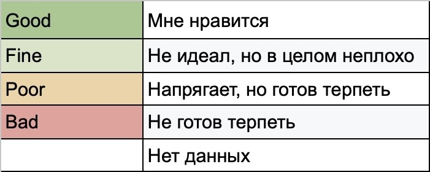
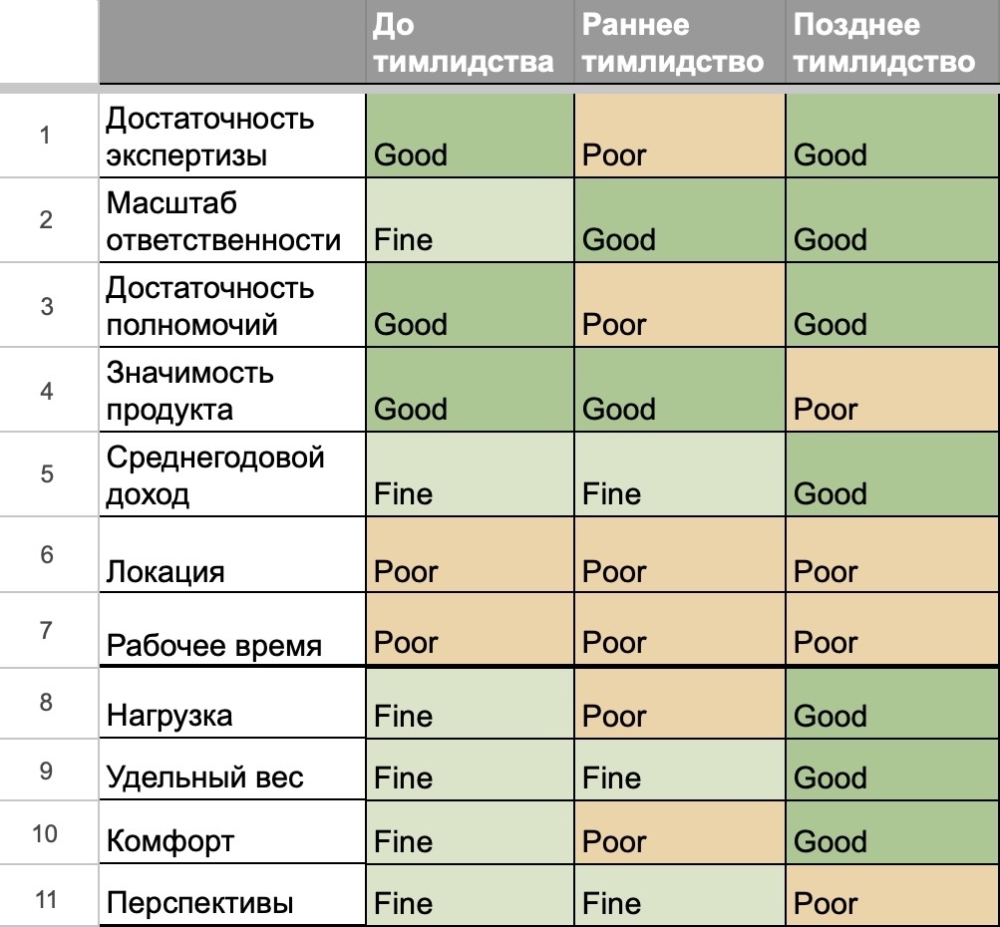

# Критерии удовлетворенности работой: от выбора вакансии до регулярной диагностики

Мы выбираем раньше, чем успеваем это осознать. И по большому счету этого достаточно: внутреннее "да" или "нет" уже есть, а рационализация мало что меняет. Но иногда однозначного ответа внутри нет, и тогда без формализации не обойтись. В статье я расскажу о том, какие критерии я использую для оценки вакансий, а также — чтобы понять, насколько меня и членов моей команды устраивает работа.

Я не использую для этого скоринг с баллами и итоговой суммой. Оценки по разным критериям здесь не аддитивны: высокий балл по одному параметру не компенсирует низкий по другому. Отличная зарплата не отменяет неприемлемый график, а несколько плюсов не превращают один явный блокер в приемлемый вариант.

Поэтому я использую качественную оценку — степень соответствия моему запросу здесь и сейчас. Она не абсолютна и не универсальна. Если данных на момент оценки не хватает, я оставляю поле пустым.

Итак, начнем с критериев, которые можно оценить по описанию вакансии, слухам, косвенным признакам и информации, полученной в ходе отборочных испытаний.

## 1. Достаточность экспертизы

Насколько моя текущая экспертиза покрывает требования роли.

В одном случае ничего дополнительно осваивать не надо. В другом большая часть опыта переносима, но придется добрать часть стека. А в третьем переход фактически означает новую профессию.

Оценка здесь будет зависеть не только от разницы "я сейчас" и "я в новой роли", но и от доступного ресурса на ее покрытие. Например, смена стека требует времени и сил. С работой их не остается, а без нее нужен запас денег на жизнь. Поэтому такая цена для меня приемлема только если у меня достаточно накоплений, чтобы не работать.

## 2. Масштаб ответственности

Насколько мне подходит масштаб системы, продукта или направления, за которые я отвечаю.

CTO маленького стартапа и CTO крупной компании могут оба отвечать за всю технологическую часть, но масштаб этой ответственности будет разным. Он пропорционален количеству людей, вложенных денег, организационной и технологической сложности.

## 3. Достаточность полномочий

Хватает ли мне возможностей влиять на то, за что я отвечаю.

Если с меня спрашивают, мне нужны инструменты. Формальная должность сама по себе этого не гарантирует. Ограничивать могут: легаси, непосредственные коллеги, смежники, процессы, менеджмент, политические игры внутри компании, внешний регулятор, наконец.

Например: продукт популярный, задача интересная — но продукт зарабатывает много, цена ошибки высокая, код — легаси. Вдобавок HR-легаси — опытная команда, давно поделившая зоны ответственности. Формально я отвечаю за результат, а на деле любые инициативы будут упираться в негласные границы и чьи-то интересы.

## 4. Значимость продукта

Насколько у проекта есть аудитория, приносит ли он деньги. Или если это внутренний продукт — насколько от него зависят другие команды и процессы. Для меня здесь важно, есть ли ощущение сопричастности к тому, что влияет на мир вокруг.

Домен для меня не особо важен: интернет-магазин, видеоигра, облачная инфраструктура или медицинский сервис — все это может давать ощущение значимости, если это кому-то нужно.

Коммерция или опенсорс — и там, и там может быть как что-то популярное, так и никому не нужное.

При этом с масштабом здесь нет связи. Крупный проект может не взлететь, а гиперказуалка, собранная за месяц на коленке, может стать хитом.

## 5. Среднегодовой доход

Насколько устраивает реалистичная оценка дохода от этой формы занятости в пересчете на год.

Для найма это фактически зарплата, включая бонус, но с учетом того, что его сумма и наличие не гарантированы на 100%. Для фриланса или проектной занятости учитываются простои между заказами и риск остаться без следующего контракта.

## 6. Локация

Насколько мне подходит пространственный регламент работы.

Офис может давать нужную социальную среду, но дорога туда — съедать два часа в день. Релокация в разные периоды жизни может быть как плюсом, так и блокером.

## 7. Рабочее время

Насколько мне подходит временной регламент работы.

Фиксированный график дает внешний организующий фактор, а свободный позволяет самому распределять время. Сюда же относятся гибкость начала и конца рабочего дня и возможность делать перерывы.

## Ожидание и реальность

До выхода на работу все эти оценки остаются прогнозом. Можно собрать много информации о вакансии и компании, но в реальности ожидания могут не оправдаться как в одну, так и в другую сторону. Задачи окажутся легче, чем предполагалось, когда-то популярный продукт может оказаться на излете, а бюрократия будет увеличивать время доставки кратно.

Кроме того, уже потом становится видно то, что заранее оценить невозможно: реальную нагрузку и рабочую среду, свое место в команде, перспективы. Поэтому после выхода добавляются еще несколько критериев.

Такую декомпозицию я использовал и как тимлид для диагностики каждого члена команды. Фиксировал оценки раз в полгода и отслеживал динамику. Это позволило более предметно обсуждать вопрос удовлетворенности на тет-а-тетах.

Поехали дальше, нумерация остается сквозной.

## 8. Нагрузка

Насколько много ресурса я трачу на рабочие активности.

Это не только про количество задач или номинальных рабочих часов. На нагрузку влияют темп, частота переключений, неопределенность, авралы и общий уровень напряжения.

## 9. Удельный вес

Доля моего участия в общем результате.

Можно работать над популярным продуктом, иметь достаточный объем ответственности и полномочий, но постепенно оказаться на периферии. Важные задачи постоянно достаются другим, а мое мнение на обсуждениях аккуратно игнорируется. Бывает, наоборот: проект сам по себе небольшой, но от моих решений в нем действительно многое зависит.

## 10. Комфорт

Насколько комфортна среда, в которой я оказался.

Это и про офис, и про удобство рабочего места и инструментов, и про человеческие отношения, и про уровень доверия в команде. Все то, что может делать работу приятнее, а может, наоборот, сделать ее невыносимой.

## 11. Перспективы

Насколько работа допускает со временем изменение моей роли.

Можно расширять стек или персональные зоны ответственности, брать другой тип задач. Речь тут не столько про карьерный рост. Вопрос в том, есть ли пространство для маневра, если в какой-то момент нынешняя конфигурация перестанет устраивать или просто надоест.

## Реальный пример с последнего места работы

Динамика моей удовлетворенности последним местом работы, на котором неизменными оставались только жесткая привязка к офису и фиксированный график 9-18.

До тим-лидства масштаб ответственности уже казался тесноватым. Но в целом устраивало: экспертизы и полномочий хватало, продукт был успешным, деньги и нагрузка — вполне норм.

Когда я только стал тим-лидом, очевидно, менеджерской экспертизы не хватало, в некоторых технических вопросах были пробелы, а полномочия упирались в зависимость от легаси как в коде, так и в команде. Все это отразилось и на комфорте, и на нагрузке.

Уже позже, когда опыта стало достаточно, постепенно собралась новая команда, мы начали новый проект, удовлетворенность достигла максимума за все время работы там. Кроме привязки к офису и графика оставались еще два минуса: новый проект по независящим от нас причинам не дошел до глобального запуска, и перспектив для моего дальнейшего роста в компании уже не было.

#менеджмент #самоорганизация 