# Сплит на 36 клавиш — неочевидный путь к слепому десятипальцевому набору
В детстве меня каждый раз поражало, как в фильмах виртуозно набирали текст на клавиатуре, не отрывая взгляда от экрана. Как только у меня появился свой компьютер, я несколько раз пытался освоить слепой десятипальцевый набор. Возвращался к этой идее с интервалом в несколько лет, но каждый раз бросал: прогресс шел медленно, нервной энергии тратилось много. Хотеть-то хотел, а вкладываться в это был не готов.

Позже я занялся эргономикой и эстетикой рабочего места. И неожиданно для себя все-таки осилил этот навык. Только пришел к нему через сплит на 36 клавиш. В статье расскажу, что мне мешало в стандартной клавиатуре и что помогло минимизировать затраты на освоение сплита.

Это не энциклопедическое руководство по клавиатурам и не подробный разбор какой-то одной темы. Здесь я старался удержать верхнеуровневый обзор личного пути: какие возникали вопросы, какие были идеи, что получалось по ходу. Технические детали будут только по необходимости. Если читателя что-то заинтересует, все отсылки легко можно найти.

Итак, эта статья для тех, кто:

- искренне не понимает, зачем привычной клавиатуре могут быть нужны альтернативы;

- давно и безуспешно хочет освоить слепой набор;

- уже добровольно ест кактус со своим первым сплитом и пока не решил, как далеко стоит заходить.

## С чего все началось

Несколько лет назад я решил минимизировать вред, который наносит рабочее место опорно-двигательному аппарату. В вопросах эргономики я консервативен. Мне подходит классическая схема: сидеть достаточно прямо, не держать руки на весу, иметь опору под локти и предплечья. С этим разобрался быстро: выбрал стол с подъемным механизмом и столешницей с вырезом под тело, хорошее офисное кресло и кронштейн для монитора.

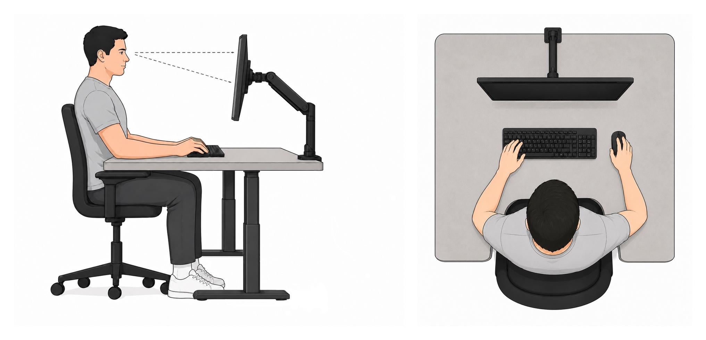

Подъемный механизм стола позволяет не только периодически работать стоя, но и настроить сидячую посадку точно под свой рост. Дефолтная офисная мебель спроектирована под усредненного человека. Это оказалось действительно важно: пара сантиметров туда-сюда — и вот то самое напряжение в воротниковой зоне, от которого потом болит шея и голова.

После этого внимание переключилось на клавиатуру и мышь. Полноразмерная клавиатура с навигационным блоком и нампадом заставляет держать мышь далеко в стороне от основного блока.

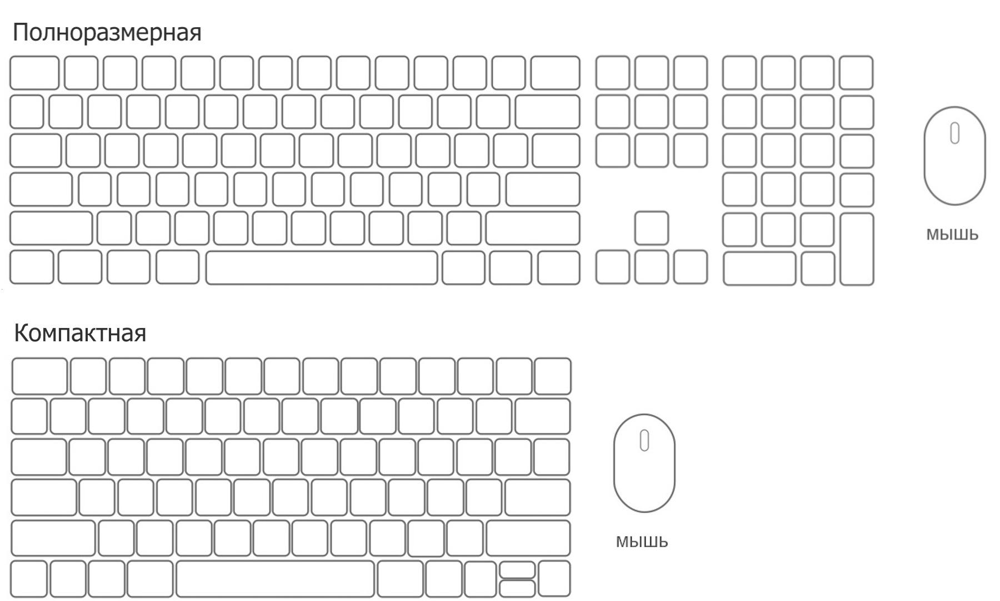

Кажется, не так страшно, но на практике это постоянный перенос руки туда-сюда в течение всего дня. При этом начинается адаптация: чтобы мышь была ближе, клавиатура понемногу съезжает влево, за ней — руки, а потом и все тело оказывается немного развернутым. И все это ради чего: нампада, которым никогда не пользовался, и навигационного блока, в котором нужны только стрелки.

Заменой клавиатуры на компактную можно было бы и ограничиться. Но не получилось.

## Клавиатурная эстетика

Когда рабочее место перестало быть дефолтным, в фокус внимания стали попадать модные интерьеры удаленщиков из интернета. Больше всего в них притягивали внимание необычные клавиатуры. Так открылся ящик Пандоры механических клавиатур. За 2 года через мои руки прошло более двух десятков экземпляров. За это время я перепробовал почти все форматы: TKL, 75, 65, 60, alice 75, alice 65. Низкие и высокие профили корпусов. Разные профили кейкапов. Свитчи низкие, высокие, легкие и тяжелые, тактильные и линейные. Смазка свитчей и стабилизаторов, шумоизоляция и более изощренный моддинг. Затянуло меня по полной — все свободное время было посвящено этому хобби. Мой профиль на Авито может рассказать об этом лучше любых статей.

Процесс взаимодействия с клавиатурой сам по себе уже стал приносить удовольствие: визуально, тактильно, по звучанию — вполне себе способ раскрасить рабочие будни. При этом с точки зрения эргономики, скорости и точности набор текста изменился незначительно. Да, стало чуть лучше: клавиатура перестала быть фоном, поэтому я начал замечать, как держу руки и как двигаются пальцы.

Тогда я сделал очередную попытку овладеть слепым десятипалом: вспомнил теорию, сел за тренажеры. Но за годы, прошедшие с моих прошлых попыток, мало что изменилось. Я начал примерно такие же тренировки и примерно тем же закончил. Красивая и приятная клавиатура не помогла.

## Поиск причин

Самое простое объяснение — моя бездарность. Но оно ничего не дает: закрывает вопрос, а не помогает разобраться. Я решил посмотреть на сами клавиатуры: что в их конструкции может мешать, если после перебора всевозможных форматов слепой набор все равно не становится естественным?

Здесь я не буду повторять типичные для таких статей заходы в историю клавиатур — статья не об этом. Просто перечислю свои главные претензии к стандартной конструкции, которые сохраняются в любом формате. Размер меняется, но основной блок с буквами и цифрами остается тем же.

### 1. Зоны ответственности пальцев

На схеме каждому пальцу соответствует свой цвет.

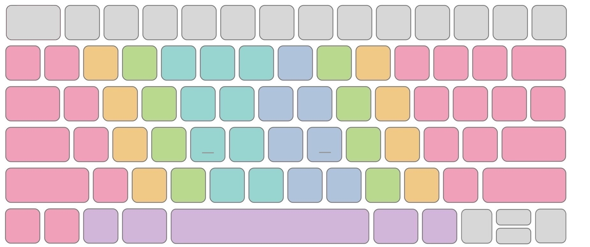

Чтобы добавить драматизма, выделю островками клавиши, используемые для набора букв и цифр.

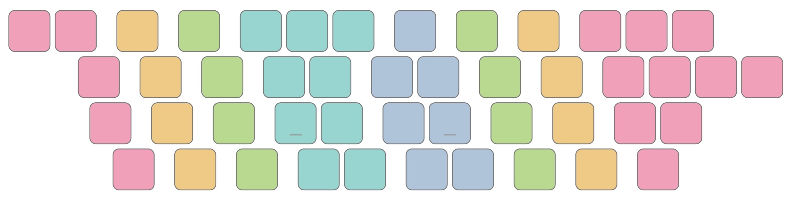

По-моему, это сложно даже запомнить, не то что на этом наработать автоматизм.

### 2. Асимметрия левой и правой руки

На схеме островков видно, что нижний ряд клавиш справа удобнее ложится под пальцы, чем слева. Левая сторона заставляет неестественно подгибать мизинец для Z, а X и C проще нажимать не теми пальцами.

### 3. Пальцев сильно меньше, чем клавиш

Неизбежно будут участки, в которых удаление от "домашнего ряда" слишком велико. Это приводит к смещению кисти в сторону и потере дефолтного положения, в которое вернуться — это отдельно нарабатываемый навык. Карта комфорта нажатия клавиш с позиции домашнего ряда (при условии соблюдения зон ответственности) это и показывает. Зеленый — удобно, красный — нет.

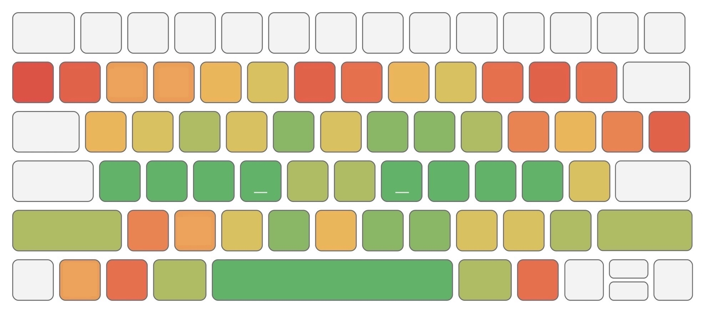
Кстати, неудобство той самой левой половины нижнего ряда тут тоже хорошо видно.

## Что с этим можно сделать?

По большому счету — ничего. Из трех вышеупомянутых пунктов более или менее скомпенсировать можно только один — под номером 2 — асимметрию левой и правой руки. Это называется ["angle mod"](https://colemakmods.github.io/ergonomic-mods/angle.html).

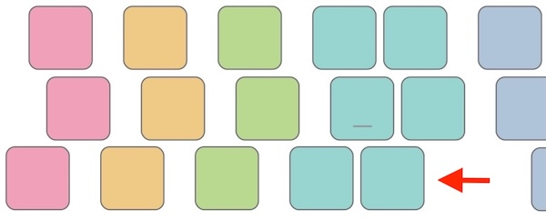

И то, проще всего это сделать на клавиатурах ISO — с коротким левым шифтом. Справа от него есть бесполезная клавиша, за счет которой можно сдвинуть нижний буквенный ряд левой руки (Z, X, C, V, B) на 1 позицию. Я сделал это на базе Keychron K3 Max. Теперь видно, как правая и левая части основного блока клавиш стали более симметричными.

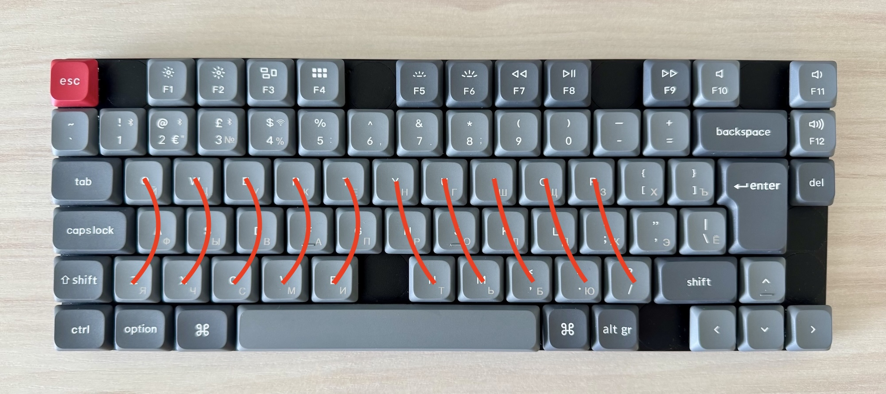

Если бы я не пошел в сторону сплитов, остановился бы на этой клавиатуре. И да, вам не показалось: на ней убрано еще несколько ненужных клавиш.

## Геометрическое решение

Без изменения геометрии все проблемы не решить. Нужно убрать горизонтальный стаггер — смещение рядов, которое имело технический смысл на печатных машинках. И добавить вертикальный — смещение колонок, обоснованное анатомически. Пальцы у нас разной длины и гнутся в суставах по дуге; вертикальное смещение колонок ставит клавиши ровно туда, куда палец опускается.

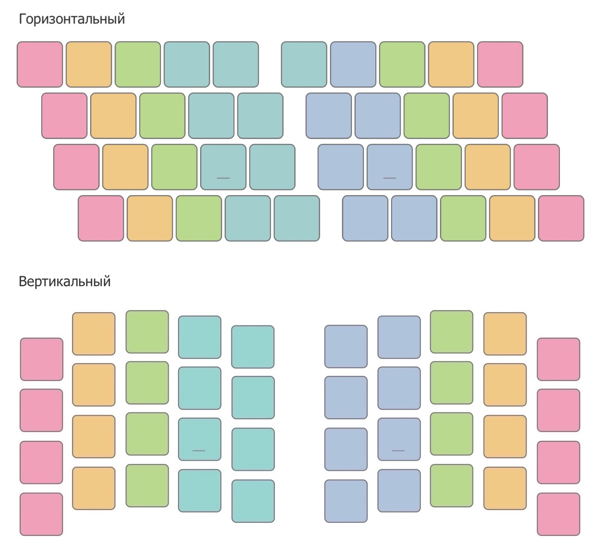

Замена горизонтального на вертикальный стаггер сходу решает первые две проблемы. У каждого пальца теперь четкая вертикаль, а также пропадает асимметрия.

Но третья проблема — много клавиш, далеко тянуться — никуда не делась. Геометрия расположила пальцы более естественным образом, но клавиш по-прежнему больше, чем пальцы могут достать с домашнего ряда без лишнего напряга.

## Минимизация

Когда я впервые увидел в интернете клавиатуру с менее чем 30-ю клавишами, сильно удивился — вот же кому-то нечего делать. Но похоже, проблему большого количества клавиш можно решить, только двигаясь в эту сторону.

Прикинул, сколько может быть минимально необходимо.

- 4 пальца (большой не в счет) на каждой руке — каждому по колонке.
- В колонке — не более 3 клавиш: середина, выше, ниже — легко запомнить.

Получается 24 клавиши на 2 руки. В английском языке 26 букв, в русском — 33. Маловато. Добавляем еще по колонке для самого подвижного пальца — указательного. Теперь у нас 30 клавиш. Английские буквы покрываются с избытком, для русских — не хватает. Смотрим таблицу частотности русских букв. Выбираем из наименее популярных 3, которые можно в этот Ноев ковчег пока не брать. Понимаю, звучит дико, но я дал этой идее шанс.

Купил на Авито самый дешевый сплит с таким количеством клавиш, попробовал движения пальцев вживую. Карта достижимости клавиш с домашнего ряда на нем примерно такая.

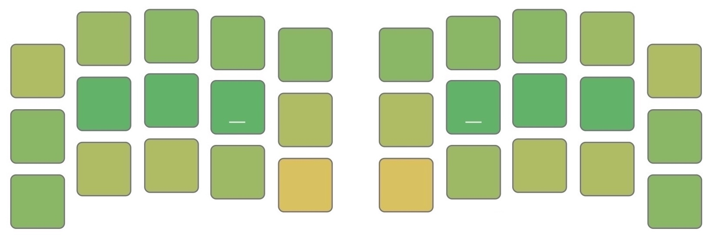

Результат уже сильно лучше, чем у стандартной клавиатуры. Вот так появилась цель, а с ней — надежда, что дело не в отсутствии таланта.

## Цена минимализма

Получается теперь, что кодов клавиш (`key code`), которые клавиатура отправляет системе, — кратно больше, чем самих физических клавиш. Что делать? Повышать смысловую емкость клавиши. Самый прямой способ — слои.

На стандартной клавиатуре уже есть похожее поведение — Shift. Когда мы удерживаем Shift и нажимаем цифру, вместо нее печатается символ. Когда букву — получаем заглавную. Для пользователя это выглядит так, будто Shift меняет смысл клавиши.

Но технически Shift работает на уровне `char code`, а не `key code`. Клавиатура по-прежнему отправляет в систему код нажатой клавиши и отдельно сообщает, что зажат модификатор Shift. А уже операционная система или приложение решает, какой символ (`char code`) из этого получится: строчная буква, заглавная, цифра или знак препинания.

В программируемых клавиатурах слой работает уровнем ниже. Он меняет не `char code`, который получится из нажатия, а сам `key code`, который клавиатура отправит в систему. На основном слое клавиша с латинской K отправляет код K. А при активации навигационного слоя та же физическая клавиша может отправлять уже код стрелки вниз.

Кроме слоев есть и другие подходы: комбо, кратные нажатия и прочие. В минималистичных клавиатурах в любом случае надо как-то реализовывать многозначность клавиш. Это — главная цена. Сложность не уменьшается, она проявляется иначе.

## Сплит как основная клавиатура

В какой-то момент я понял, что пора переходить от теории к практике.

Освоение сплита — это не только отработка нового моторного навыка, но и в значительной степени его создание. Приходится заново распределять действия по ограниченному числу клавиш на слоях. Более популярное и важное должно оказаться ближе и удобнее, менее — можно унести дальше.

Главное, что "удобно" у каждого свое. Кто-то больше пишет тексты на естественных языках, кто-то — код с большим количеством спецсимволов. У всех разные ОС, хоткеи, рабочие сценарии и старые моторные привычки. Поэтому каждый сплитовод в итоге приходит к своему варианту: в чем-то повторяет чужой опыт, что-то находит свое.

Сразу оговорюсь: когда я только планировал заход в тему сплитов, хардварный DIY я для себя сразу исключил. Благо сейчас есть много готовых вариантов, и пайка для этого уже не обязательна. Я не хотел собирать клавиатуру, разбираться в контроллерах и прошивках. Мне нужно было проверить, поможет ли другая геометрия освоить слепой набор и сделать работу за клавиатурой комфортнее.

Но даже если не лезть в железо, перейти сразу на минималистичный сплит со слепым набором — это уже слишком много за раз. Ввязаться в такое — гарантированный провал, особенно если нужно оставаться функциональным в течение рабочего дня.

Поэтому я решил делать это в 2 этапа:

- сначала освоить новую геометрию с вертикальным стаггером, минимизировав остальные изменения;

- потом постепенно уменьшать количество клавиш.

Я не буду утомлять рассказами о долгих хождениях кругами, это будет более прямая версия моего пути.

### Этап 1. Освоить полноразмерный сплит

Требования были такими:

- не менее 58 клавиш;

- на кейкапах обязательны легенды — нанесенные символы;

- паттерн работы с модификаторами (Shift, Cmd, Ctrl, Alt) оставить привычным — для меня — на левой стороне;

- при выносе части кейкодов на слой учитывать совместность использования, например, стрелки и удаление часто по очереди используются при редактировании текста или кода.

Изменения по сравнению со стандартной клавиатурой получились такими:

- вертикальный стаггер;
- 4 менее популярные клавиши основного блока переезжают на непривычные места;
- добавляется только 1 слой, и то по необходимости — навигационный;
- правый Shift съехал ниже из-за буквы "Э".

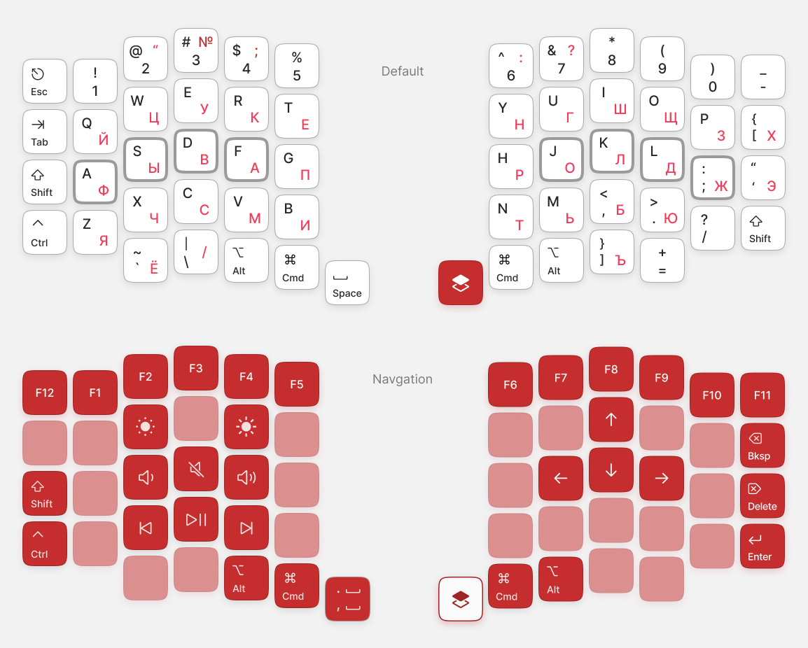

На схеме видно, что на навигационном слое много незанятых клавиш. Их можно отдать под клавиши, к которым вы привыкли, но которые не нашли себе места на основном слое. Занимать сразу все я бы не рекомендовал, потому что поначалу обязательно будут промахи.

При наборе текста разделителями между словами, кроме пробелов, могут быть еще и знаки препинания. А если точнее, то это либо пробел, либо знак препинания, за которым следует пробел. Так вот, я на навигационном слое поставил на клавишу пробела самые популярные после самого пробела разделители:

- запятая + пробел;
- точка + пробел — через Shift.

Пунктуация почти перестала нарушать беглый поток при наборе естественных текстов.

Процесс адаптации оказался дольше, чем я ожидал. В статьях по освоению сплитов обычно даются оценки: от 2 недель до 1 месяца. Но моя честная оценка — 3-4 месяца, пока уровень комфорта во всех кейсах вернется к исходному:

- написание естественных текстов (переписка, заметки, подготовка к встречам),
- работа с кодом в IDE (английский, символы, хоткеи),
- работа с терминалом, файловым менеджером и хоткеи в прочих приложениях.

И это при том, что у меня был всего один дополнительный слой!

Вот мои спутники на этом этапе.

Sofle Choc

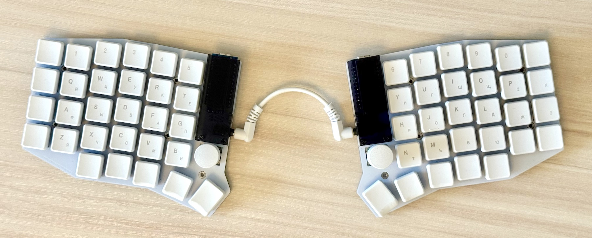

Sofle MX в деревянном корпусе от Восхода

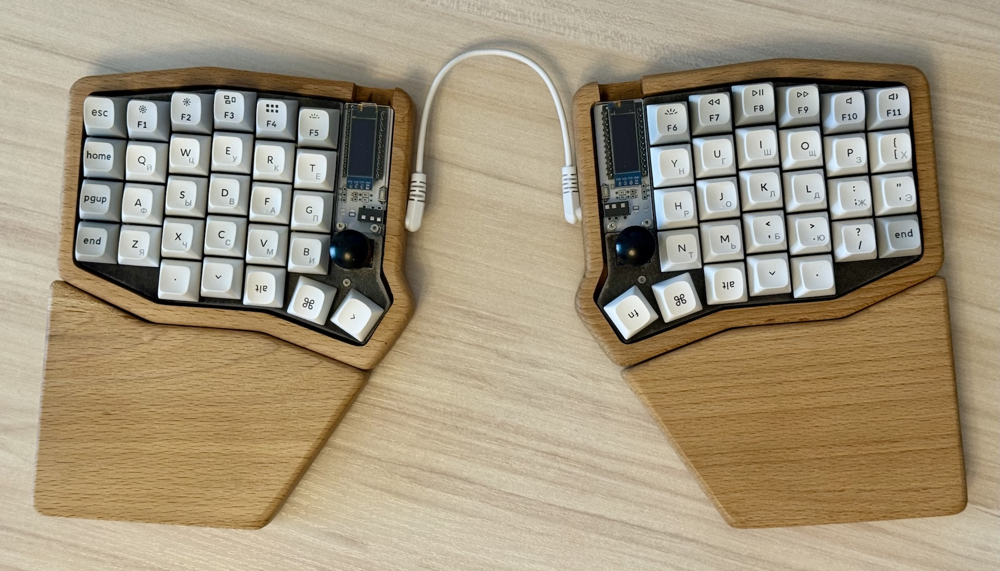

На первой я пристрастился к легким линейным свитчам всего 25 гр, в мире MX таких не найти. Это был интересный опыт — пальцы буквально летают над плоскостью клавиш. От MX версии тоже было свое удовольствие: алюминий, натуральное дерево, шумоизоляция между ними, скульптурный профиль кейкапов.

### Этап 2. Убираем лишнее

К этому моменту я по навыкам был все еще ближе к стандартной клавиатуре, чем к минималистичному сплиту. Главное достижение — удалось более или менее закрепить зоны ответственности пальцев. Самым сложным оказалось переучивание того самого левого нижнего ряда, конкретнее — клавиши Z, X, C. При этом я все еще подглядывал на легенды, уносил руки от домашней позиции.

Но пора двигаться дальше. Чтобы прийти к заветной формуле `3x5` на каждой половинке, надо избавиться от верхнего (цифрового) ряда, а также от внешних колонок. Ну и еще от 2 внешних клавиш в нижних рядах, оставив внизу только тамб кластер. Беда в том, что уже сейчас остались только нужные клавиши. Поэтому избавиться нельзя, надо перенести. Куда? Правильно, на слои. Значит, на слои должны переехать:

- цифры;
- символы;
- те самые три русские буквы, о которых я обещал не забыть;
- несимвольные клавиши (Esc, Tab и прочие).

Напомню, что главным ограничителем для меня была скорость изменений. Я не мог себе позволить все сломать и сидеть учиться работать за клавиатурой заново. Поэтому я пошел постепенно. Начал с символов и по счастливой случайности вместе с этим удалось пристроить и эти три несчастные русские буквы.

#### Символы и русские буквы

Символьную раскладку я не стал брать первую попавшуюся. Поизучал подходы к этому вопросу, и доверился тому, чего хочется мне самому. А именно: разделить кейсы использования по половинкам. Я больше пишу естественных текстов, чем кода. Поэтому на более удобную для меня половину я разместил более популярные для меня символы, а на левую — все остальные.

Нужных символов опять оказалось больше 30. В итоге символьный слой у меня получился "двухэтажный". Самые непопулярные символы уехали на "второй этаж". Что это значит? Когда мы активируем слой, можем добавить, например, Shift как модификатор, и тогда получим символ "со второго этажа".

На символьном слое добавил пробел, чтобы не перебрасывать большой палец, так как "символ + пробел" — частая комбинация.

На этот слой также уехали и те самые три русские буквы. Они в числе самых редких русских букв. Я их подсмотрел в [раскладках Никиты Широкова](https://github.com/braindefender/universal-layout) для ортолинейных клавиатур. Крутая идея! Похожие буквы находятся на одной клавише:

- "Щ" — "Ш",
- "Ъ" — "Ь",
- "Ё" — "Е".

Отлично, но если внимательно посмотреть на раскладку, то клавиша в правом нижнем углу не содержит буквы. Переместим на русском языке в нее букву "Э".

В итоге имеем 3 больших изменения:

- появился символьный слой, который надо выучить с нуля;

- немного изменилась русская раскладка ЙЦУКЕН — поменяли положение буквы З, Х, Э, Щ, Ъ, Ё;

- правый Shift вернулся на свое место, а с ним добавился еще Ctrl для симметрии.

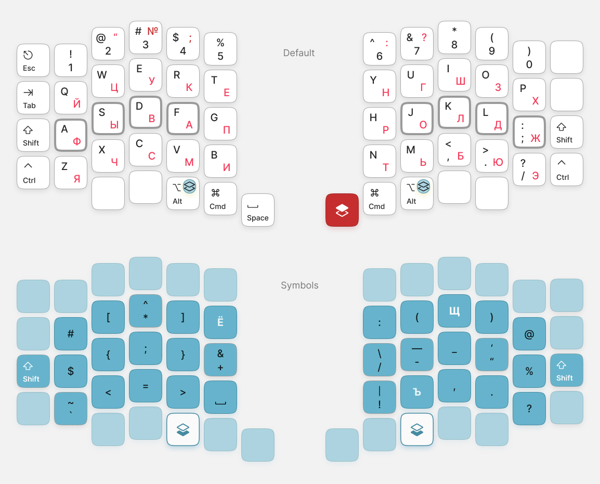

Обратите внимание на Alt. Символьный слой технически у меня это не слой в памяти клавиатуры. На маке Alt активирует другой слой чаркодов. Как на винде AltGr. Это оказалось очень удобным: пишешь текст — Alt позволяет набирать символы, в хоткеях Alt — модификатор в комбинации клавиш. При работе через удаленный рабочий стол (на той стороне, правда, тоже мак) все эти символы так же печатаются. Поэтому символьные раскладки у меня реализованы через кастомные раскладки в операционной системе и мне этого хватает. Для редактирования есть приложение [Ukelele](https://software.sil.org/ukelele/).

Кириллица

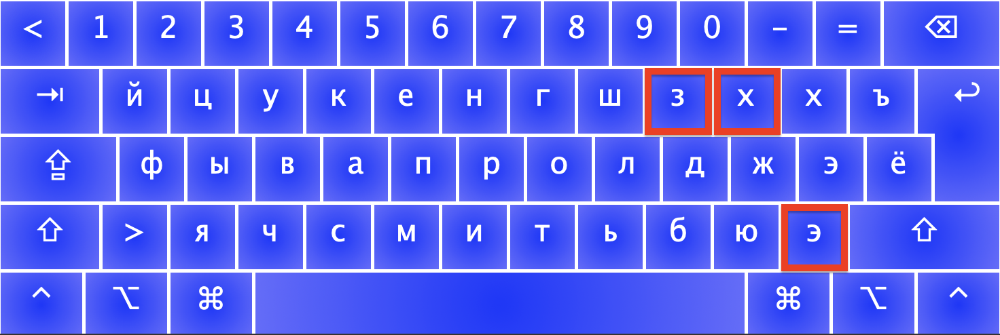

Символьный основной — Alt

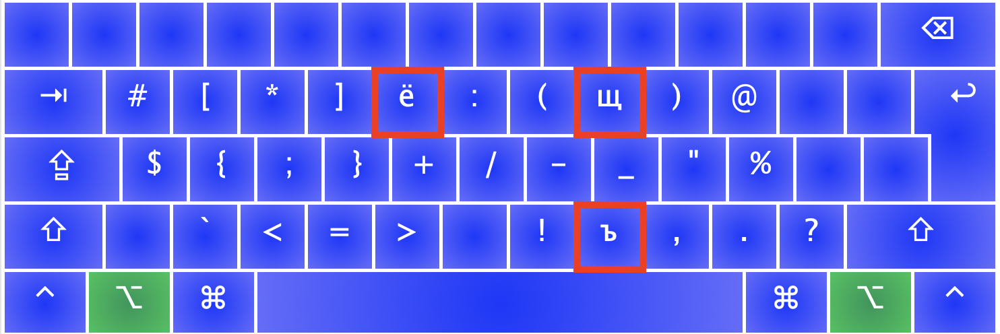

Символьный с шифтом — Alt + Shift

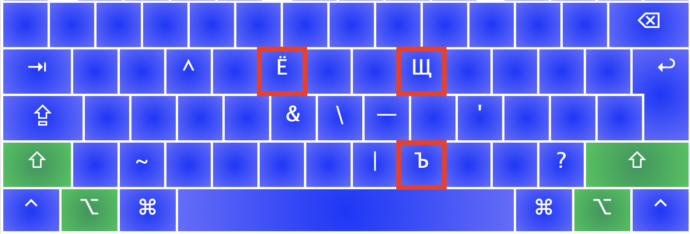

Эти изменения я гонял где-то еще 2-3 месяца до автоматизма. Но это все еще полноразмерный сплит. Зато все меньше подглядываю на легенды. Вертикальный стаггер удерживает пальцы на своих зонах естественным образом.

Итого уже полгода, слепой набор все ближе!

Здесь может возникнуть вопрос: почему для "лишних" букв не использовать комбо, ведь это популярный подход. Пробовал — не понравилось.

#### Убираем верхний ряд

Верхний ряд — это цифры, с шифтом — символы. Но с символами мы уже разобрались. Значит, остались только цифры. Не совсем. Там еще Esc. Переход на 42 клавиши — новый челлендж:

- цифры и F-row выстраиваются зеркальными сетками в разных слоях;

- цифровой слой активируется удержанием клавиши пробела — новая механика tap-hold;

- Tab уезжает со своего привычного места, которое теперь занимает Esc.

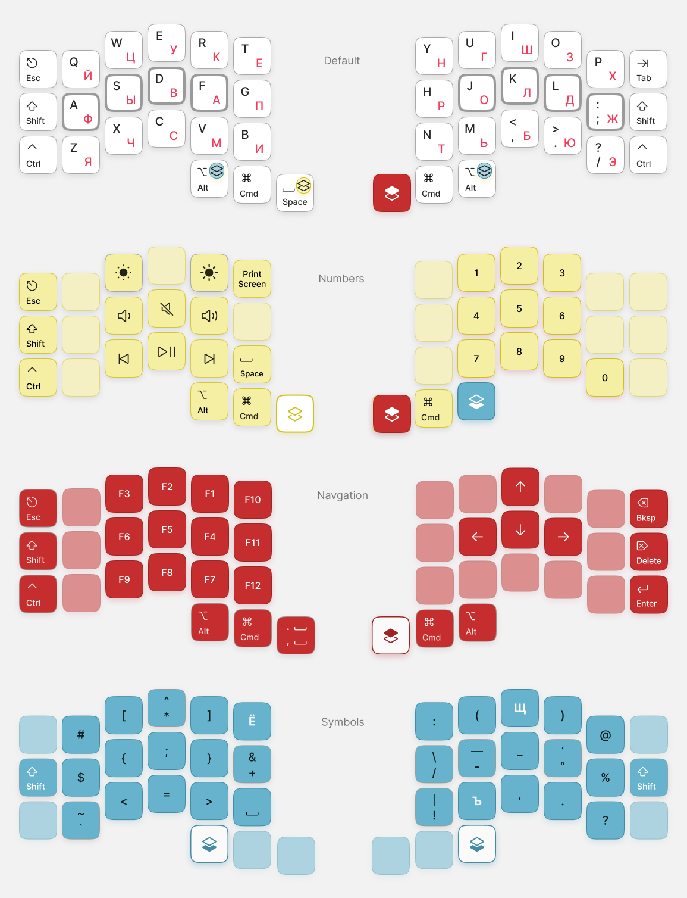

Модификаторы на привычных местах. Осваиваю цифры и функциональные клавиши столбиками. Активация цифрового слоя через tap-hold требует такой настройки, чтобы при печати не было ложных срабатываний слоя. В современных прошивках есть эвристики, которые помогают добиться нужного результата.

На цифровом слое сделал переход на символьный, чтобы при комбинациях типа времени или арифметических выражений, левый большой палец не уставал от переносов. Так же как и для символьного слоя добавил пробел над обычным пробелом, чтобы не отпускать клавишу слоя.

На привыкание к этим изменениям ушла еще пара месяцев. За это время слепой набор на русском почти случился, я даже поставил кейкапы без русских легенд. Вместо этого держал под монитором шпаргалку.

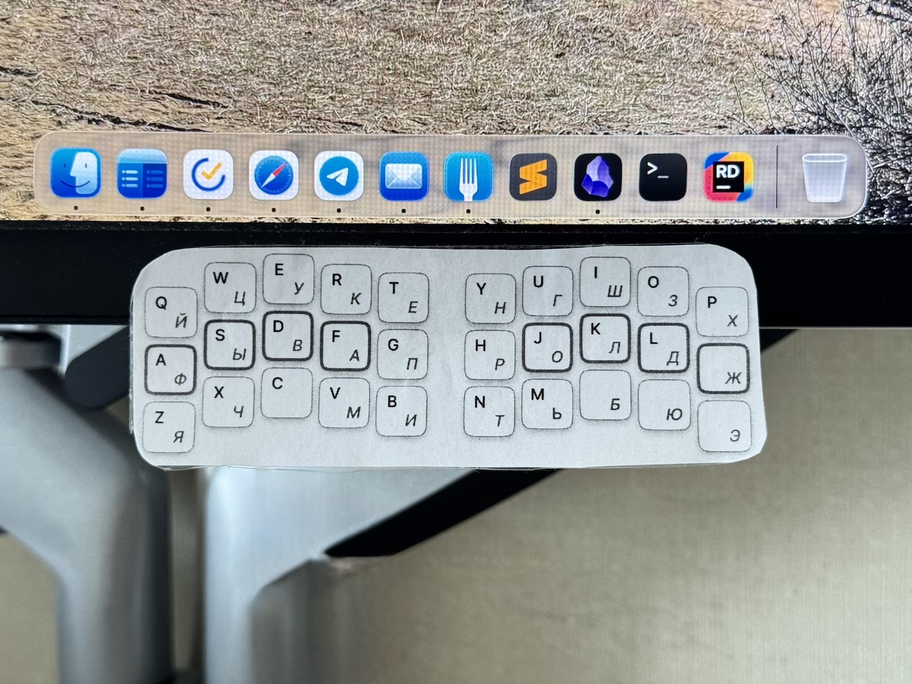

#### Последний шаг

Внешние колонки. Надо ли их убирать? В наборе текста они не особо участвуют. Только если Shift. В любом случае мне не нравилось, что мой самый неловкий палец — мизинец — отвечает за 2 колонки. Есть от этого какая-то постоянная фоновая напряга.

Долой сомнения, теперь уходят:

- Esc,
- Tab,
- модификаторы Shift и Ctrl.

Их куда-то надо девать. На основном слое остались 2 клавиши, имеющие дублирующие кейкоды. Очевидно, модификаторы должны оставаться на основном слое. Значит, Tab уезжает на навигационный слой, а Esc... уже там.

2 клавиши, отвечающие за удаление и Enter, на навигационном слое автоматически сдвигаются ближе — побочный плюс. Но за время работы накопилась неудовлетворенность этим вариантом. Вроде все хорошо, но мизинец в целом не такой точный, как указательный палец, а действия удаления и Enter довольно критичные. И я решил до кучи перенести и их.

Итоговая раскладка для сплита на 36 клавиш.

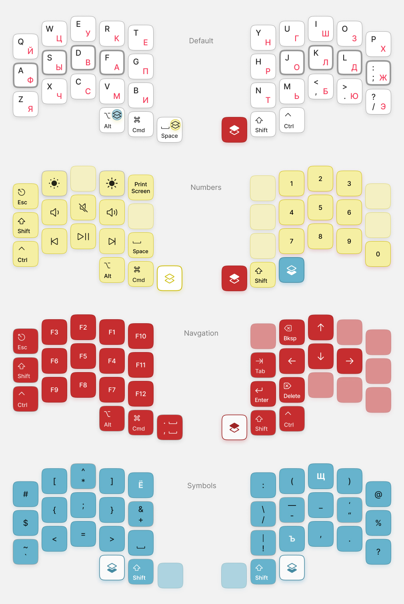

Модификаторы Ctrl и Shift переехали на правый тамб. На маке они как раз хорошо сочетаются с правой рукой. Большинство хоткеев — это Cmd + Shift или Cmd + Ctrl. И поэтому они разнесены по разным сторонам. На навигационном слое модификаторы Shift и Ctrl остались неизменны. Это удобно, потому что сохраняется привычка с навигационными действиями удерживать Shift при выделении текста. Shift на тамбе популярен — удобно капитализировать буквы без выбора правый-левый Shift.

А еще для сплитов такого размера очень популярен способ размещения модификаторов на домашнем ряду через механику tap-hold — [Home Row Mods](https://precondition.github.io/home-row-mods). Но я сознательно решил не идти в эту сторону, чтобы сохранить большую часть мышечных паттернов работы с модификаторами от стандартной клавиатуры.

Esc быстро стал привычен на цифровом слое через удержание клавиши пробела.

Backspace и Delete разместил перпендикулярно горизонтальной линии стрелок — в голове никаких коллизий.

Enter переехал на клавишу, которую теперь сложно нажать случайно. Цена такого промаха критична — отправка недописанного сообщения или запущенная раньше времени команда. В итоге получилось удачное сочетание точности указательного пальца и места, требующего более осознанного движения.

## Финал

Фактически я уже работал за 36-клавишным сплитом. Осталось только это зафиксировать в железе. Последней покупкой в начале этого года был беспроводной алюминиевый [Omega Point 36](https://eh.works/op36) от [Ergohaven](https://eh.works). Недавно они же выпустили скульптурные кейкапы, которые делают расстояние между пальцами и поверхностью контакта более равномерным. Сплит сам плоский, а капы добавляют скульптурности. Причем не как обычно "цилиндром", а "сферой". Рекомендую, делает карту достижимости еще зеленее.

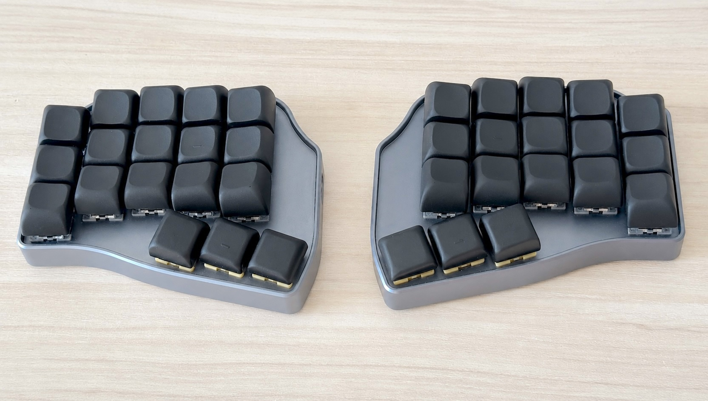

Прошел год с покупки первого сплита. Цель достигнута — слепой десятипальцевый набор я осилил. Легенд на клавишах нет, сама работа за клавиатурой стала гораздо комфортнее. Ну и в качестве приятного бонуса скорость значительно выросла. На русскоязычных текстах — 70-90 wpm. И это не излишество, ведь раньше на скоростях в районе 50 wpm мысль сильно убегала вперед. Думаю, такой заметный прирост связан с более естественными движениями пальцев.

Также важно, что на уровне навыка я не потерял обратную совместимость со стандартной клавиатурой. Да, я как не умел на ней печатать полностью вслепую, так и не умею. Но когда я беру ноутбук, дискомфорта не испытываю. Первые минут 5 горизонтальный стаггер чуть напрягает, но потом проходит. Главное — основные паттерны работы с модификаторами активируются без проблем.

А еще рад, что вовремя остановился и не пошел в сторону дальнейшего хардкора: tap dance, combos, home row mods, magic keys, кастомизация языковых раскладок  (colemak, dvorak, диктор...). Для меня это был рубеж, за которым первоначальная задача эргономики уже превращалась в самостоятельное хобби.

Если кому-то будет интересно попробовать мою раскладку для Omega Point 36, то вот [мой форк](https://github.com/ken48/ergohaven-zmk-config) репозитория производителя.

#юзабилити