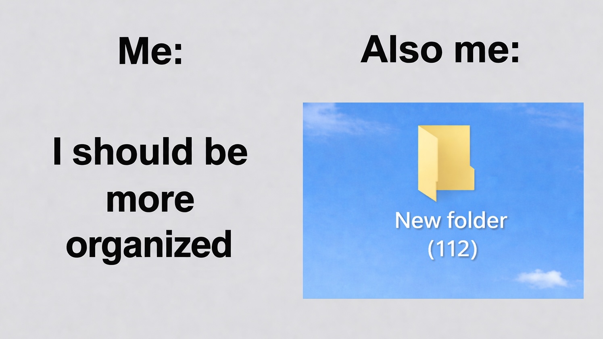

# Дневник, заметки, рабочий лог — как они у меня оказались в одной папке



Я много лет веду записи в трех разных форматах: заметки, личный дневник и рабочий лог. Они появились в разное время и всегда были отдельно друг от друга.

## Заметки

Я бы назвал это фотоальбомом маленьких открытий: заметил связь — сложилось понимание — записал — почувствовал удовлетворение. Это что-то типа интеллектуальной эстетики.

Поэтому заметка для меня — это способ запечатлеть мысль, а не черновик, который когда-нибудь дозреет до статьи. Если мысль вернется позже, это будет уже новой заметкой. Когда идея приходит заново, обычно это немного другое понимание, взгляд с другого ракурса. В этом отличие от second brain. Там заметка — объект, который дорабатывают, связывают с другими. У меня заметка похожа на снимок. Иногда она может стать публичной в виде поста в блоге или даже основой для статьи. Но это, скорее, побочный эффект.

## Личный дневник

Дневник я веду нерегулярно, только когда есть запрос. Это не хроника событий. Это способ разбираться с внутренними процессами — мне в письменном виде это проще, чем крутить в голове. В каком-то смысле это психогигиена: формализовать эмоции и понять, что со мной происходит.

В отличие от заметки, которая фиксирует мысль или наблюдение, дневниковая запись помогает разобраться с личной ситуацией. Иногда из такого разбора потом вырастает и заметка — уже как наблюдение более общего характера.

## Рабочий лог

В роли руководителя нужно помнить конкретику: кто что сделал, как повел себя на встрече, где что-то пошло не так, какое решение было принято и почему. Без записи детали быстро забываются, а на ретроспективе или ревью общими словами потом не отделаться. По сути это внешняя память, хронология наблюдений, которую можно поднять по необходимости. Ценность этой практики в фиксации фактов, а не их интерпретаций, как в заметках и дневнике.

## ИИ-ретроспектива

Все изменил ИИ. С записями стало возможно работать как аналитику с базой данных: задавать вопросы и искать закономерности на любом временном масштабе. Ретроспектива, которая раньше требовала кропотливой ручной работы, стала дешевой.

Сначала я использовал это только для работы — там фокусы понятны заранее: команда, процессы, решения. Для личных вопросов фокусы заранее трудно определить, но теперь это уже не обязательно: можно просто записывать, ИИ сам увидит, на что стоит посмотреть. Так к рабочему логу добавился сначала личный дневник, а потом и заметки. Теперь у меня одна база, где каждая запись — это просто текст с датой. Единственным решением остается только писать или не писать.

Замечу, что глобальной цели вроде "упорядочить жизнь" у меня изначально не было. Каждая из трех практик начиналась со своей отдельной задачи. То, что из этого получилась сквозная система саморефлексии, — побочный эффект соседства записей и появления ИИ.

## Время как связь

В объединенной базе я ничего не связываю вручную — ни тегов по темам, ни ссылок между записями. Связь восстанавливается по факту соседства во времени: что лежит рядом, то и связано. Теги я не использую сознательно, потому что это попытка классифицировать запись заранее. Дата такой проблемы не создает.

Интересное в этом, что ИИ в такой базе умеет находить связи. Например, один и тот же внутренний процесс может проявляться сразу в нескольких сферах, но внешне выглядеть как разные истории. Попытка справиться с тревогой неопределенности в рабочем логе может отразиться как эпизод микроменеджмента, в дневнике — как гиперопека детей, а в заметках — как упоминание темы лидерства.

## Как устроено

Принципиально — это plain text, отдельные файлы, git. Конкретно — это Markdown, Obsidian, GitHub. Синхронизация между телефоном и компьютером происходит через git-плагины Obsidian — бесплатно и без привязки к одной экосистеме. На десктопе я использую плагин `Git` (самый популярный, легко находится в каталоге community plugins), на мобиле — `Fit`, он умеет авторизоваться напрямую через GitHub. Схему взял из [этой статьи на Хабре](https://habr.com/ru/articles/843288).

Obsidian настроен так, что новая запись сразу создается в нужной папке с датой через core plugin "Daily note".

Структура папок:

```
raw/
└─ 2026/
   └─ 03/
      └─ 2026-03-14 Topic.md
      └─ 2026-03-14 12-30-00.md

retros/
└─ 2026/
   └─ 2026-03.md
   └─ 2026.md

agents.md
```

Имя файла содержит дату и, если есть, тему. Папки `YYYY/MM` дублируют дату — это сознательная избыточность: связи между записями она не меняет, но навигация в архиве (и для меня, и для ИИ) становится быстрее.

Теги только для фильтрации.
Когда заканчиваю писать, задаю себе два вопроса:

- пригодится ли это на рабочей ретроспективе — если да, ставлю `#work`;
- можно ли этим поделиться — если да, ставлю `#public`.

Еще есть `#agent` с указанием модели — он проставляется в файлах ретроспектив. Больше тегов нет, ссылок тоже.

Для ИИ-ретроспектив в корне лежит `agents.md` — описание структуры данных, чтобы агент понимал, где что лежит и как записи соотносятся между собой. Конкретные вопросы задаются в момент запроса. Если интересно посмотреть на мой `agents.md`, вот [ссылка на репозиторий с этой статьей](https://github.com/ken48/obsidian-notes.git), где в корне лежит этот файл.

Форматирование в markdown мне надоело поддерживать руками, и я сделал для macOS [Textops](https://github.com/ken48/textops) — аналог code formatter в IDE. По хоткею он нормализует списки, пробелы, капитализацию, тире. Орфография и смысл не трогаются.

## Плюс 1. Ретроспектива глубже

ИИ берет записи за любой период и сжимает в обзор. Обзоры сжимаются дальше: месячные в годовые, годовые в общую картину. Каждый уровень снижает стоимость анализа, а исходные записи остаются нетронутыми. И вопросы теперь можно задавать не только про работу:

```
- Что сейчас в моей жизни главное и как мне в этом?
- На чем в последнее время чаще всего оказывается мое внимание?
- Совпадает ли то, что я считаю главным, с тем, что реально занимает внимание?
- Что дает энергию, а что забирает?
- Что повторяется, но не сдвигается?
- Что выпадает из поля зрения?
- Что требует действий от меня или других людей?
- Что изменилось по сравнению с предыдущей ретроспективой?
```

## Плюс 2. Запись дешевле

Больше не нужно решать на входе, куда отнести эту конкретную мысль — заметки, дневник или лог. Все идет в одну папку одним потоком.

## Итого

Получился единый архив, связанный временем. Тот же принцип, что и в едином календаре из [предыдущей статьи](https://github.com/ken48/obsidian-selforg): там время организует действия, здесь — записи.

#самоорганизация #психология #менеджмент