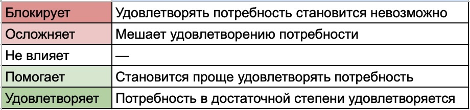

# Экономика отношений: что мы получаем, чем платим и как выбираем оставаться

Отношения, особенно длительные, всегда неоднозначны. В них можно ценить близость, поддержку и привычную жизнь и одновременно быть неудовлетворенным сексом, страдать от непонимания, недостатка свободы или чего-то еще. Человеку при этом одновременно и хорошо и плохо: обостряется то желание уйти, то страх потерять ценное.

Эту неоднозначность я попробую рассмотреть с экономической точки зрения — как обмен, в котором человек что-то получает и чем-то за это платит. Сначала разберем, как отношения влияют на удовлетворение отдельных потребностей. А затем попробуем понять, почему даже при значительных издержках человек все равно может продолжать оставаться в этих отношениях.

## Критерии оценки отношений

Когда говорят о хороших отношениях, обычно перечисляют заботу, уважение, доверие, сексуальное влечение, общие интересы, ценности и много чего еще.

Это выглядит как готовая модель: оценил удовлетворенность отношениями по этим пунктам условно от 1 до 5, и дальше пробовать менять ситуацию. Но в этом списке критериев чего-то не хватает, ведь остается куча вопросов. Если не получается улучшить, то что дальше? Или если получается, то только с 2 до 3, а дальше никак? Почему одни низкие оценки не особо беспокоят, а другие держат в постоянном напряжении? Где вообще предел: мне плохо, а я годами ничего не меняю?

Похоже, подобные критерии не слишком хорошо декомпозируют наши чувства для того, чтобы появилась достаточная ясность. Если отталкиваться от потребностей, картина становится яснее. Тогда возникает вопрос: **как отношения меняют мои возможности удовлетворять собственные потребности?**

Чтобы на него ответить, нужно посмотреть, что именно происходит с каждой из этих потребностей в отношениях.

- Что благодаря им становится проще и доступнее?
- Что я и без них получал бы примерно так же?
- А что, наоборот, становится сложнее или вообще оказывается недоступным?

И уже отсюда можно прийти к главным вопросам: **как эти отношения в целом влияют на мою жизнь и почему я продолжаю их выбирать?**

## От критериев к потребностям

Начнем с декомпозиции критериев, чтобы увидеть, как много разного и слабо связанного может скрываться за одним понятием.

Возьмем, казалось бы, самый очевидный из них — заботу. Вот какие бывают представления о ней:

- **Забота как практическая помощь.** Заболел — партнер привез лекарства. Сломалась машина — помог разобраться. В крайнем случае для разговора по душам есть алкоголь и лучший друг.

- **Забота как эмоциональная поддержка.** Когда на душе тяжело, от партнера в первую очередь нужно, чтобы выслушали и успокоили.

- **Забота как доказательство любви.** Если партнер сам замечает, что мне тяжело, и заранее подстилает соломку — значит, любит. Если ждет просьбы — значит, ему все равно.

- **Забота как давление.** Помощь без запроса ощущается как контроль и лишение свободы.

С сексуальным влечением еще интереснее. Допустим, я его оцениваю высоко. Но что это говорит о том, насколько меня устраивает сексуальная сторона отношений?

Влечение может быть взаимным, но частота секса недостаточной. Секс может быть регулярным, но может не хватать инициативы со стороны партнера. Или у нас могут сильно расходиться предпочтения, и важная для меня часть сексуальности останется нереализованной. Более того, сильное влечение к партнеру в такой ситуации может только усиливать фрустрацию.

Парадокс: сексуальное влечение может быть **высоким** и взаимным, а удовлетворенность сексуальной жизнью — **низкой**.

## Потребность как единица анализа

Получается, вместо оценки общих критериев полезнее добраться до более конкретного вопроса: **что именно мне нужно?**

Не "забота", а помощь с бытовыми проблемами, эмоциональная поддержка в тяжелом состоянии или готовность включиться по моей просьбе. Не "сексуальное влечение", а нужная мне частота секса, инициатива партнера, возможность реализовывать определенные предпочтения.

На этом уровне декомпозиции уже проще понять, что происходит. Одной потребности отношения могут помогать, другой — не мешать, третью — заметно ограничивать.

Простой тест на достаточность декомпозиции: если один пункт хочется одновременно записать и в плюс, и в минус, скорее всего, в нем все еще склеены разные потребности. "Мне хватает помощи в быту, но не хватает эмоциональной поддержки" — это две разные строки.

## Экосистема удовлетворения потребностей

Человек и до отношений как-то живет со своими потребностями и так или иначе их удовлетворяет. Что-то дает себе сам, что-то получает от друзей и родственников, что-то — через работу, деньги, увлечения, случайные связи.

Все эти способы связаны между собой и образуют своего рода экосистему. Если одного источника становится меньше, возрастает значение других. Если появляется новый способ закрывать потребность эффективнее, старые могут постепенно отойти на второй план.

Отношения встраиваются в эту экосистему и начинают ее менять. Партнер может дать новый способ удовлетворять потребность или, наоборот, затруднить доступ к тому, чего раньше хватало.

## Плюс, ноль или минус

Для каждой потребности можно посмотреть, как отношения меняют возможность ее удовлетворять.

**Плюс** — благодаря отношениям получать нужное стало проще. Появился человек, с которым можно регулярно заниматься сексом, разделить бытовую нагрузку или поделиться тем, что раньше приходилось переживать одному.

**Ноль** — потребность удовлетворяется примерно так же, как удовлетворялась бы без этих отношений. Например, партнер не вовлечен в мое хобби, но у меня осталось мое сообщество, и мне этого достаточно.

**Минус** — отношения мешают получать то, что раньше было доступно. Например, после начала совместной жизни ревность к друзьям значительно сократила возможности с ними общаться.

В экономическом смысле эти минусы и есть издержки отношений — то, чем приходится платить за участие в них. Поэтому отдельную категорию "издержек" дальше вводить не понадобится: они уже учтены как отрицательное влияние отношений на конкретные потребности.

Для общей логики достаточно плюса, нуля и минуса. Но в таблице полезно различать крайние случаи: отношения могут не просто мешать удовлетворению потребности, а фактически блокировать его. А также не просто помогать, а сами в достаточной степени удовлетворять эту потребность.

## Формализуем потребности

Для себя я делю потребности на 3 большие группы, связанные с

- выживанием,
- качеством жизни,
- экзистенциальными вопросами.

Удержание фокуса на верхнем уровне помогает удержать охват всего спектра потребностей.

Отдельно хотел бы остановиться на потребностях, связанных с выживанием. Часть из них вполне объективна: физическая безопасность, деньги, жилье, помощь в болезни, быт. Но есть и символические: автономия, уважение границ, переживание собственной ценности, надежность связи, помощь в эмоциональной регуляции.

Символические потребности в выживании особенно интересны тем, что при невротической, а тем более пограничной организации личности они выражены гораздо ярче и сильнее влияют на поведение в отношениях. Страх потери связи может превращаться в постоянные требования подтверждений, контроль, ревность, давление и попытки удержать партнера любой ценой. В более тяжелых случаях человек может сам разрушать отношения именно теми способами, которыми пытается обеспечить их надежность.

## Пример оценки по списку потребностей

Ниже — пример для условного айтишника: интроверта, который любит сидеть дома, работать за компьютером, ковырять свои проекты, не очень стремится к светской жизни, ценит автономию и тишину, хочет надежных отношений, телесной близости и семьи, при этом имеет сексуальные фетиши, которые с нынешней партнершей не получается реализовать.

Мы смотрим на отношения его глазами: таблица показывает, что именно эти отношения делают с его возможностью удовлетворять собственные потребности. Для его партнерши таблица выглядела, очевидно, иначе.

## Что показывает эта таблица?

Здесь становится видно, почему отношения могут одновременно ощущаться хорошими и плохими. Наш айтишник теряет часть автономии, забивает на спорт и не может реализовать важную часть сексуальных предпочтений. При этом отношения дают ему надежную связь, телесную близость, родительство, бытовую устойчивость и защищают от одиночества.

**Таблица делает экономику обмена видимой.**

## От ясности к выбору

Таблица может показать, в чем конкретно отношения помогают и в чем мешают, но она не отвечает на вопрос, какой обмен минусов на плюсы для меня приемлем. Никакие оценки не скажут, сколько автономии стоит телесный контакт или сколько нереализованной сексуальности стоит надежная связь.

Здесь формализация заканчивается и начинается выбор.

Как не потерять плюсы, которые для меня важны, но уже стали привычными? Какие минусы можно убрать или ослабить внутри отношений, а какие — компенсировать за счет других сфер жизни? С какими минусами придется смириться, а какие для меня неприемлемы?

## Цена альтернативы

Если какие-то минусы оказываются неприемлемыми и изменить их внутри отношений не получается, появляется другая возможность — выйти из них. И у выхода есть своя цена.

Во-первых, вместе с минусами исчезнет часть плюсов. Наш айтишник может вернуть себе автономию и получить возможность иначе устроить сексуальную жизнь, но одновременно потеряет надежную связь, привычную телесную близость, совместный быт и нынешнюю форму родительства. Что-то из этого удастся получить снова, что-то — другими способами, а что-то может не вернуться вовсе. Будущее в этом смысле всегда менее определенно, чем уже существующая жизнь.

Во-вторых, есть издержки самого перехода. В длительных отношениях старая жизнь уже собрана из множества связанных частей, и при расставании их приходится перестраивать.

| Издержка перехода            | Характер     |
| ---------------------------- | ------------ |
| Раздел имущества             | Разовая      |
| Переезд                      | Разовая      |
| Острый период расставания    | Временная    |
| Перестройка быта и привычек  | Временная    |
| Новый режим жизни с ребенком | Долгосрочная |
| Изменение круга общения      | Постоянная   |

Поэтому два человека с очень похожим набором плюсов и минусов могут принимать совершенно разные решения, если у одного переход в другую жизнь — чемодан и новый Tinder, а у другого — ребенок, ипотека, раздел имущества, переезд и двадцать лет совместной жизни.

## Субъектность

Мне все еще может быть одновременно хорошо и плохо. Но теперь я понимаю, как и за счет чего возникают эти "хорошо" и "плохо", а также чего мне будут стоить те или иные варианты. Это и есть та ясность, без которой невозможно делать осознанный выбор и быть субъектным — автором своей жизни.